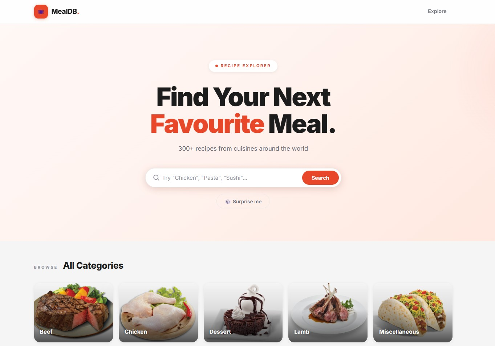

# MealDB Explorer

A full-stack recipe browsing app built with Spring Boot and React. Fetches data from [TheMealDB](https://www.themealdb.com/) public API, caches it server-side with Caffeine, and serves it through a clean REST layer to a modern React frontend.

 

## Tech Stack

| Layer | Technology |
|---|---|
| Backend | Java 17, Spring Boot 3.2, RestClient, Caffeine Cache |
| Frontend | React 18, Vite, React Router, Axios |

## Features

- Search recipes by name
- Browse all meal categories with images
- View all meals within a category
- Full recipe detail — ingredients, step-by-step instructions, YouTube embed
- Random meal discovery
- Server-side caching (10 min TTL) to avoid redundant external API calls

## Deployment

| Layer | Platform |
|---|---|
| Backend | Render (Docker, free tier) |
| Frontend | GCP Cloud Run |

**Live:** [Frontend](https://meal-db-frontend-956876727417.us-central1.run.app) · [Backend API](https://mealdb-explorer-u29h.onrender.com)

## Project Structure

```
meal-db-explorer/
├── backend/                        # Spring Boot application
│   └── src/main/java/com/example/meal_db_explorer/
│       ├── config/
│       │   └── AppConfig.java
│       ├── controller/
│       │   ├── MealController.java
│       │   └── GlobalExceptionHandler.java
│       ├── service/
│       │   └── MealService.java    # All TheMealDB calls + caching
│       └── model/
│           ├── Meal.java
│           ├── MealSummary.java
│           └── Category.java
└── frontend/                       # React + Vite application
    └── src/
        ├── api/
        │   └── mealApi.js          # Axios calls to backend
        ├── components/
        │   ├── Navbar.jsx
        │   └── MealCard.jsx
        └── pages/
            ├── Home.jsx            
            ├── CategoryPage.jsx    
            └── RecipeDetail.jsx    
```

## Getting Started

### Prerequisites

- Java 17+
- Node.js 18+
- Maven (or use the included `mvnw` wrapper)

### 1. Start the backend

```bash
cd backend
./mvnw spring-boot:run
```

The API will be available at `http://localhost:8080`.

### 2. Start the frontend

```bash
cd frontend
npm install
npm run dev
```

Open `http://localhost:5173` in your browser.

## API Endpoints

| Method | Endpoint | Description |
|---|---|---|
| GET | `/api/meals/search?name={query}` | Search meals by name |
| GET | `/api/meals/categories` | All categories |
| GET | `/api/meals/category/{name}` | Meals in a category |
| GET | `/api/meals/random` | Random meal (not cached) |
| GET | `/api/meals/{id}` | Full meal details by ID |

## Caching

Responses from TheMealDB are cached in-memory using Caffeine with a 10-minute TTL and a maximum of 500 entries. Random meal is intentionally excluded from the cache to always return a fresh result.

Cache spec is configured in `backend/src/main/resources/application.properties`:

```properties
spring.cache.type=caffeine
spring.cache.caffeine.spec=maximumSize=500,expireAfterWrite=10m
```
